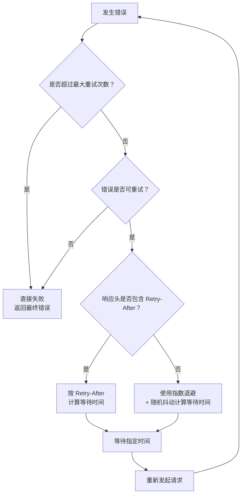

import { Callout } from 'nextra/components'
import { DocLink } from '../../../lib/doc-link'
import Image from 'next/image'
import { withBase } from '../../../lib/base-path'
import { ZoomableImage } from '../../../lib/zoomable-image'
import { CodeBlock } from '../../../lib/code-block'
import { SourceLink } from '../../../lib/source-link'

# 1.3 Agent的错误处理策略

前面我们已经把 Chat、流式输出、SSE、工具调用这些核心能力串起来了。

到这一步，一个最小可用的 Agent 已经能跑起来：用户发来一句话，模型开始流式回复；如果需要工具，就触发工具调用；工具执行完，再把结果交回模型；最后生成用户能看到的答案。
当然工具部分我们还没有开始，后续我们会逐步学习。

听起来已经挺完整了。

但只要你真的把它放到真实环境里跑，很快就会发现：Agent 最麻烦的地方，往往不是“正常情况下怎么跑”，而是“出问题的时候怎么办”。

因为 Agent 不是一次简单的函数调用。它中间可能经过很多环节：

<ZoomableImage
    src={withBase('/images/common/error-line.png')}
    alt="Agent Loop 流程图"
    width={960}
    height={540}
/>

这条链路里，任何一环都有可能出错。

模型接口可能 429 限流，可能 500 抽风，可能网络超时；流式响应可能突然卡住，连接还没断，但也不再返回新 token；工具调用可能失败，外部 API 可能慢得像在摸鱼；某个 Provider 可能临时不可用；甚至用户的网络也可能中途抖一下。

如果我们不设计错误处理策略，Agent 的表现就会非常“脆”：
- 用户只看到一句冰冷的错误提示；
- 一次临时网络波动，就让整个任务失败；
- 某个模型服务短暂抽风，所有请求全部挂掉；
- 流式连接卡住后，前端一直转圈，后端也不知道该不该结束；
- 工具失败后，模型不知道怎么继续，用户也不知道发生了什么。

这类问题在 Demo 阶段不明显，因为你只是在本地跑几次，网络也稳定，请求量也不大。但一上生产，它们会立刻冒出来。
所以，真正的 Agent 系统必须有一套错误处理策略。

这套策略的目标不是“保证永远不出错”。这是不现实的。接下来的内容，我们掰开了揉碎了，来看在Agent开发过程中，具体的错误处理应该如何去做。

## 并不是所有错误都值得重试
一说到错误处理，很多人的第一反应就是：失败了，那就停了吧，报个错；亦或着那就重试一下。这个想法不能说错，但也不能无脑用。

在 Agent 系统里，模型调用、工具调用、外部 API 请求、数据库操作都可能失败。不同失败背后的含义完全不一样。有些错误只是临时抖了一下，等一会儿再试可能就好了；但有些错误从一开始就不应该重试，因为你重试 100 次也不会成功，反而只会浪费 token、拖慢响应，甚至把系统打得更糟。
所以，错误处理的第一步不是“立刻重试”，而是：

**先判断这个错误到底值不值得重试。**

比如大模型 Provider 返回的 401、403 这类错误，通常就不应该重试。
- 401 一般表示认证失败，比如 API Key 错了、过期了、没传，或者签名不对。这个问题不是等几秒就能恢复的。你继续重试，只是在不断拿着一把错钥匙开门。
- 403 一般表示权限不足，比如当前 Key 没有访问某个模型的权限、账号没有开通对应能力，或者被策略拦截。这类错误也不是重试能解决的。你需要换 Key、换模型、调整权限，而不是原地重试。

再比如 400 Bad Request，很多时候是请求参数有问题：
- model 名称写错了；
- messages 格式不符合要求；
- tools schema 不合法；
- temperature、max_tokens 等参数越界；
- 上下文太长；
- 某个字段传了 provider 不支持的值。

这类错误本质上是“请求本身有问题”。如果请求体不变，重试几次结果都一样。所以它应该尽快失败，并把错误暴露给开发者或上层调度器，而不是进入重试循环。

但有些错误就不一样。
比如 429 Too Many Requests，通常表示触发了限流。它不是说你的请求永远不能处理，而是当前打得太快了。这个时候，稍微等一等，再重试，就有机会成功。

再比如 408 Request Timeout，通常表示请求超时。可能是网络抖动，也可能是 Provider 临时响应慢。这种错误也可以适当重试。

还有 500、502、503、504 这类服务端错误，通常代表上游服务暂时异常、网关错误、服务不可用或超时。它们也具备重试价值，但不能无限重试。

所以，我们可以先把错误粗略分成两类：

| 错误类型 | 是否建议重试 | 原因 |
|---|---|---|
| 400 Bad Request | 通常不重试 | 请求参数或格式错误，请求不变则必然失败 |
| 401 Unauthorized | 不重试 | 认证失败，API Key 或签名问题 |
| 403 Forbidden | 不重试 | 权限不足或策略禁止 |
| 404 Not Found | 通常不重试 | 模型、接口或资源不存在 |
| 408 Request Timeout | 可以重试 | 可能是网络或上游临时超时 |
| 409 Conflict | 视情况重试 | 资源冲突，部分场景可稍后重试 |
| 422 Unprocessable Entity | 通常不重试 | 参数语义不合法 |
| 429 Too Many Requests | 可以重试 | 限流，等待后可能恢复 |
| 500 Internal Server Error | 可以重试 | 上游临时异常 |
| 502 Bad Gateway | 可以重试 | 网关或上游服务异常 |
| 503 Service Unavailable | 可以重试 | 服务暂时不可用 |
| 504 Gateway Timeout | 可以重试 | 网关超时，可能临时恢复 |

当然，这张表只是第一层判断。真实系统里还要结合业务场景。

## 错误处理策略

### 1. 单次失败如何重试
如果我说这是一个复杂的主题，很多伙伴会疑惑？重试，那就`while`循环呗，设置一个最大重试次数，多次循环不就好了；

<CodeBlock title="最朴素的重试写法" defaultOpen>

```java
int maxRetries = 3;
int attempt = 0;
while (attempt < maxRetries) {
    try {
        return callModel();
    } catch (Exception e) {
        attempt++;
        if (attempt >= maxRetries) {
            throw e;
        }
    }
}
```
</CodeBlock>

我们来假设一个场景，你现在做的这个Agent有1000用户在使用；这个时候你的服务出现了瞬间的网络波动，导致所有人都报错500，那么在同一时间，所有的agent都会进入重试,我们来假设一个场景：你现在做的 Agent 有 1000 个用户同时在线。某一瞬间，上游模型服务或者你自己的网络出口出现了短暂波动，导致这一批请求全部返回 500。

如果你的重试策略是“失败后立刻重试”，那么这 1000 个请求会在同一时间重新打向上游。

也就是说，原本只是 1000 个失败请求，马上变成：
```text
第 1 轮：1000 个请求失败

第 2 轮：1000 个请求立刻重试

第 3 轮：1000 个请求再次重试

第 4 轮：1000 个请求继续重试
```
如果每个请求最多重试 3 次，那么短时间内，上游可能要承受 4000 次请求冲击。更糟糕的是，这些重试几乎是同时发生的。

这就像高速路上前面堵了一下，后面的车没有减速，反而所有车一起踩油门往前冲。结果不是恢复通行，而是把小拥堵撞成大事故。

在分布式系统里，这种现象通常叫**重试风暴（Retry Storm）**。本来上游只是短暂抖了一下，但大量客户端同时重试，会把上游继续打满；上游越慢，失败越多；失败越多，重试越多；最后形成恶性循环。

当然，既然是一个常规现象，那必然也有常规解法，核心策略是指数退避（Exponential Backoff）+ 随机抖动（Jitter）。

#### 1.1 指数退避

所谓指数退避，就是失败次数越多，下一次重试前等待的时间越长。

比如第一次失败后等 500ms，第二次失败后等 1s，第三次失败后等 2s，第四次失败后等 4s。它不是每次都用固定间隔重试，而是让请求自动“慢下来”。

用公式表示，大概是这样：

```text
delay = baseDelay * 2 ^ retryCount
```
假设 baseDelay = 500ms，那么几次重试的等待时间就是：
```text
第 1 次重试：500ms

第 2 次重试：1000ms

第 3 次重试：2000ms

第 4 次重试：4000ms
```
这样做的好处很明显：如果上游只是短暂抖动，第一次或第二次重试就可能恢复；如果上游还没恢复，后面的请求会越来越克制，不会像疯了一样持续撞上去。

但指数退避还不够。因为如果 1000 个 Agent 在同一时间失败，它们算出来的退避时间也是一样的。大家第一次都等 500ms，第二次都等 1000ms，第三次都等 2000ms。结果只是从“立刻一起撞墙”，变成了“排好队一起撞墙”。

这时候就需要随机抖动。

#### 1.2 随机抖动（Jitter）
所谓随机抖动，就是不要让每个请求都等待完全一样的时间，而是在一个范围内随机选一个等待时间。

比如理论上这次应该等 2000ms，但我们不固定等 2000ms，而是随机等：
```text
0ms ~ 2000ms
```
或者保守一点：
```text
1000ms ~ 2000ms
```
这样一来，原本同一时刻重试的请求，就会被打散到一段时间窗口里。对上游服务来说，这个差别非常大。

系统最怕的往往不是“总请求数很多”，而是“某一瞬间请求尖峰太高”。随机抖动解决的就是这个尖峰问题。

所以，生产环境里更推荐的重试策略通常不是单纯的指数退避，而是：
```text
指数退避 + 随机抖动 + 最大重试次数 + 最大等待上限
```
<ZoomableImage
    src={withBase('/images/common/jitter.png')}
    alt="Agent Loop 流程图"
    width={960}
    height={540}
/>

#### 1.3 Retry-After
前面我们说了，遇到 429、503 这类临时性错误时，可以使用“指数退避 + 随机抖动”来重试。
但还有一种情况更特殊：**上游服务已经明确告诉你，多久之后再来。**

这就是 `Retry-After`。

`Retry-After` 是 HTTP 响应头里的一个字段，常见于限流或服务暂时不可用的场景。比如模型 Provider 返回了 429 Too Many Requests，同时带上：

```http
Retry-After: 2
```
意思就是：你现在请求太快了，请 2 秒后再试。
也可能是一个具体时间：
```http
Retry-After: Wed, 21 Oct 2026 07:28:00 GMT
```
意思是：到这个时间点之后再试。

所以当响应里带有 Retry-After 时，我们不要再自己拍脑袋算等待时间，而应该优先尊重服务端给出的建议。

更合理的判断顺序是：

不过，生产环境里还要加一个保护：**不要完全无上限地相信 Retry-After**。
比如上游返回：
```http
Retry-After: 3600
```

意思是 1 小时后再试。

如果你的 Agent 是一个实时对话应用，显然不可能让用户等 1 小时。所以我们通常还会加一个最大等待上限：
```java
long delayMs = retryAfterMs
        .map(value -> Math.min(value, maxDelayMs))
        .orElseGet(() -> calculateBackoffDelay(attempt, baseDelayMs, maxDelayMs));
```

也就是说：**尊重 Retry-After，但不能让它无限拉长用户等待**。

### 2. 非业务报错如何处理
除了常见的 HTTP 异常以外，还有一类问题更隐蔽：**SSE 连接没有报错，也没有断开，但不再推送数据了。**
也就是说，从表面上看，这条连接还活着；浏览器没有触发 `error`，后端也没有抛异常，Nginx 也没有主动断开连接。但用户界面上的输出停住了，模型不再返回 token，工具状态也没有变化。

这类问题很容易把用户体验拖死。

因为它不像 401、429、500 那样有一个明确的错误码。它更像是“卡住了”：
如果不处理，用户只能一直盯着一个“正在生成中”的界面，直到自己刷新页面。

所以，流式场景里不能只处理“显式报错”，还要处理“沉默”。

#### 2.1 流式卡住，本质是超时问题
对于 SSE 来说，最麻烦的不是连接断了，而是连接没断但没有新数据。

这种情况可能来自很多地方：

* 上游模型服务卡住；
* 中间代理缓冲了数据，没有及时下发；
* 网络链路半开；
* 服务端线程阻塞；
* 工具调用迟迟没有返回；
* Provider 的流式接口没有正常结束；
* 前端 EventSource 仍然保持连接，但已经收不到有效事件。

所以我们要给流式响应加一个判断：如果超过一段时间没有收到任何有效事件，就认为这条流已经不健康。

这个时间可以叫：`idle timeout` 也就是“空闲超时”。它不是整个请求的最大耗时，而是：距离上一次收到有效数据，已经过去了多久。比如设置：`idleTimeout = 30s`。

含义就是：如果 30 秒内没有收到任何 token、工具事件、心跳事件，就认为流式响应卡住。

#### 2.2 心跳机制：让“沉默”变得可检测
解决 SSE 卡住问题，最常见的方式是心跳机制。SSE 协议允许服务端发送注释行：
```text
: heartbeat\n\n
```

这种消息不会触发业务事件，也不会显示给用户。它的作用就是告诉客户端：连接还活着，我还在。

也可以用自定义事件：
```text
event: ping
data: {"time": 1710000000000}
```
前端收到后不展示，只更新时间戳。这样，客户端就可以维护一个 lastEventAt：`每收到 token、tool_event、heartbeat，就更新 lastEventAt`。
然后定时检查：`当前时间 - lastEventAt > idleTimeout`

但这里要注意一点：心跳不等于模型还在生成。它只能说明：`服务端和客户端之间的 SSE 连接还活着`。但如果服务端只是一直发心跳，而上游模型已经卡死了，用户仍然收不到任何实际内容。
所以心跳机制应该分两层看：
| 心跳类型 | 说明 | 解决的问题 |
|---|---|---|
| 连接心跳 | 服务端定期发 `: heartbeat` | 防止代理或浏览器因为长时间无数据断开 |
| 业务心跳 | 后端检测上游流是否持续有内容 | 判断模型或工具是否卡住 |

## 降级处理策略
前面我们讲了错误分类、重试策略、Retry-After、心跳检测，以及流式中断后的对账恢复。这些策略解决的是一个核心问题：**系统出错后，能不能尽量自己恢复。**

但真实环境里还有一种情况：系统确实恢复不了，或者继续恢复的成本太高。
比如：

- 当前模型 Provider 连续超时；
- 流式接口一直卡住，但非流式接口还能用；
- 高级模型暂时不可用，但普通模型还能正常响应；
- 工具服务响应太慢，继续等待会严重影响用户体验；
- 用户当前请求不一定非要完整 Agent 能力，只要先给一个普通回答也可以；
- 某个外部 API 宕机，但我们可以先返回缓存结果或简化结果。

这时候，如果系统只有两种状态：成功和失败，那它就会非常脆。因为只要某个环节达不到最理想状态，整个 Agent 就只能报错结束。但生产级系统通常不会这么做。它会多准备几条“退路”。
这就是降级处理。

在Agent开发里的降级，而是在完整能力不可用时，主动切换到一个更简单、更稳定、成本更低的方案，让用户至少能得到一个可用结果。

但是，和常规的业务降级不同，Agent的降级并不是一个单纯的降级过程，我们从一个完整的Agent流程开拆解这件事情：

<Callout type="info">
当Hi-Agent正在处理一个DeepSearch的任务，他已经完成了初步的检索，输出了一部分内容，同时也完成了第一个search 的工具调用；深度的search正在进行的时候，我们的大模型服务断掉了
</Callout>

在这个 DeepSearch 场景里，我们手上已经有了三类产物：
* 一段已经输出给用户的文本；
* 一个已经完成的 search 工具调用；
* 一个还没有完成的工具调用

这三类产物的处理方式完全不同。

- 第一段文本已经被用户看到了，它不能假装不存在。如果我们重新生成一份回答，用户可能会看到前后内容重复，甚至看到两个互相矛盾的版本。
- 已经完成的 search 工具调用也不能随便丢掉。它可能花了时间、消耗了额度，甚至查到了关键资料。如果降级时直接重跑，不仅浪费资源，还可能因为外部搜索结果变化，得到和第一次不一样的内容。
- 最麻烦的是那段未完成的工具调用。它可能只是模型还没把参数输出完整，也可能工具已经开始执行但结果还没回来。

因此，Agent 降级的第一步不是切模型，也不是重试，而是：**冻结现场，盘点状态。**

可以把当前执行过程拆成几类状态：

| 产物类型 | 是否可信 | 降级时如何处理 |
|---|---|---|
| 已输出文本 | 用户已看到，但未必完整 | 保留为"已生成预览"，不要重复输出 |
| 已完成工具调用 | 可信，应该复用 | 写入上下文，继续给后续模型使用 |
| 未完成工具调用参数 | 不可信 | 丢弃，不执行 |
| 已提交但未返回的工具 | 状态不确定 | 先查询工具状态或等待超时 |
| 已持久化消息 | 可信 | 以数据库为准 |
| 前端临时状态 | 仅作预览 | 中断恢复时不能作为最终事实 |

基于我们梳理的Agent异常处理的状态，我们开始来看具体的降级处理策略。

### 1. 冻结现场
这里的“冻结现场”，不是说把整个系统停掉，而是给当前这一次 Agent Run 打上一个临时的“暂停处理”状态，先不要继续往下推进，也不要立刻重新发起请求。
为什么要冻结？

因为此时系统处在一个很尴尬的中间态，如果这时候立刻重试或者切模型，就很容易把现场搞乱。比如，已经完成的 search 被重新执行一次；已经展示给用户的内容又生成了一遍；未完成的工具调用被误认为完整工具调用；数据库里还没写完的状态被新的请求覆盖。
所以，冻结现场的目的就是：**先停止自动推进，防止二次破坏。**

具体来说，冻结现场至少要做几件事：
| 动作 | 目的 |
|---|---|
| 标记当前 run 状态为 degrading 或 recovering | 防止同一个 run 被重复处理 |
| 停止继续消费当前异常流 | 避免继续接收不完整或错乱的事件 |
| 禁止自动执行未完成工具调用 | 防止半截参数触发真实工具 |
| 保存已经收到的文本片段 | 保留用户已经看到的预览内容 |
| 保存已经完成的工具结果 | 后续降级时可以复用 |
| 查询或等待正在执行的工具状态 | 判断工具到底成功、失败还是超时 |
| 从数据库重新读取 run/message 状态 | 以持久化数据为准做恢复 |

冻结之后，系统才进入第二步：真正的降级过程。

### 2. 流式到非流式的降级
如果模型服务的流式接口中断，但我们已经拿到了完整的已完成工具结果，就可以把这些工具结果作为上下文，重新发起一次非流式模型调用，让模型生成最终总结。这个时候，非流式调用不是从头开始，而是基于已经完成的现场继续：

```text
用户原始问题
+ 已经输出过的部分思路
+ 已完成的 search 结果
+ 明确标记未完成的 search 已被取消
→ 生成一个收尾回答
```

### 3. 切换备用 Provider
如果当前 Provider 完全不可用，可以把已经完成的上下文和工具结果交给备用模型。但这里也要注意，备用模型不一定理解原 Provider 的工具调用格式，所以我们不能直接塞原始 tool_call，而应该塞统一后的内部事件或工具结果摘要。
```text
已完成检索：
- query: "xxx"
- result: "xxx"

未完成检索：
- 已取消，不参与最终结论
```

## 小结

这一节我们专门讨论了 Agent 的错误处理策略。

如果说前面几节解决的是“Agent 正常情况下怎么跑”，那么这一节解决的就是：**Agent 出问题时，怎么稳住。**

Agent 和普通接口不一样。一次 Agent 请求里，可能同时包含模型调用、流式传输、工具执行、外部 API 请求、数据库读写和最终结果返回。链路越长，出错点就越多。真正的生产级 Agent，不能只靠一个 `try-catch` 硬扛，也不能失败后无脑重试。

这一节我们先讲了错误分类。

不是所有错误都值得重试。像 400、401、403 这类错误，多数是请求参数、认证、权限问题，原样重试没有意义；而 408、429、500、502、503、504 这类错误，往往具有临时性，可以进入重试策略。错误处理的第一步，不是立刻重试，而是先判断：这个错误到底有没有恢复可能。
接着我们讲了单次失败的重试策略。
最朴素的 `while` 循环虽然简单，但在生产环境里很容易制造“重试风暴”。当大量请求同时失败，又同时重试时，原本只是一次短暂抖动，可能会被放大成系统级故障。所以更合理的做法是使用：

```text
指数退避 + 随机抖动 + 最大重试次数 + 最大等待上限
```

指数退避让失败后的请求逐渐放慢，随机抖动把大量请求打散到不同时间点，避免所有请求整齐地再次打向上游。如果上游返回了 Retry-After，还要优先尊重上游给出的冷却时间，但也不能无上限等待，需要结合业务场景设置最大等待上限。

然后我们讨论了非业务报错，尤其是流式场景里的“沉默失败”。
SSE 最麻烦的问题不一定是连接断开，而是连接看起来还活着，却再也没有新数据推送。用户界面一直转圈，后端也没有明确异常，这类问题比普通 HTTP 错误更难发现。

也就是说，流式系统不能只处理“显式报错”，还要主动检测“沉默”。没有错误码，不代表没有错误；连接没断，也不代表任务健康。

最后，我们讲了降级处理策略。

降级不是简单地从“成功”切到“失败”，也不是粗暴地重来一遍。尤其在 Agent 场景里，一次任务可能已经输出了一部分文本、完成了部分工具调用、还有一些工具调用处于半完成状态。此时如果直接重试或切换模型，很容易造成内容重复、工具重复执行、数据库状态混乱。

这一节最重要的思想可以总结成三句话：

<Callout type="info">
- 先分类，再重试；  
- 先冻结现场，再降级；  
- 先对账状态，再决定是否重来。
</Callout>

真正稳定的 Agent，不是永远不失败，而是失败时不会乱。

它知道哪些错误可以重试，哪些错误应该直接失败；知道什么时候该等待，什么时候该切换；知道流式卡住后如何检测，也知道降级前不能破坏已经发生的现场。

到这里，我们的 Hi-Agent 已经不只是一个“能跑起来”的 Demo，而是开始具备生产级系统该有的韧性。


